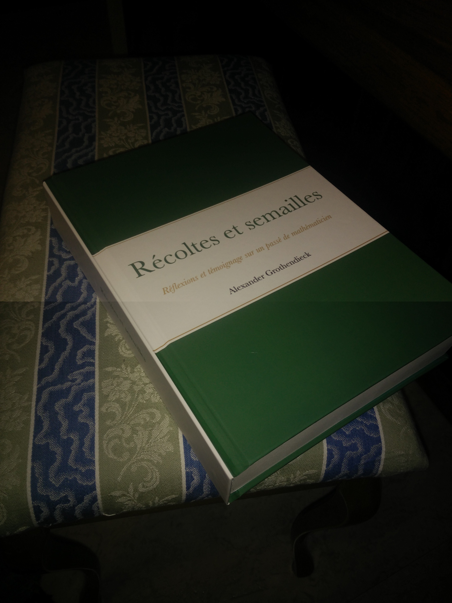
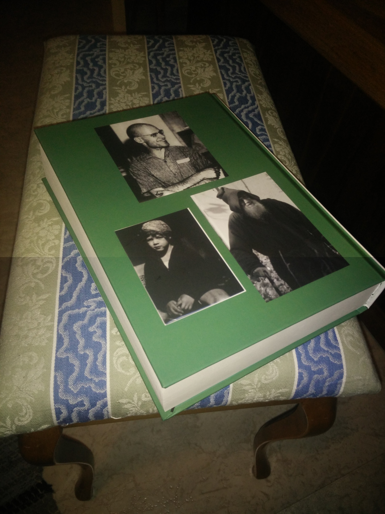

# Translation of _Récoltes et Semailles_
## _Réflections et témoignage sur un passé de mathématicien_
### Written by Alexander Grothendieck, in the early 1980s.

Roy Lisker translated most of [the promenade](https://uberty.org/wp-content/uploads/2015/12/RS-grothendeick1.pdf). So it makes sense to continue where he left off, namely with the section called "Epilogue: les Cercles invisibles". Links to the various translated sections will be added in the [table of contents](table-of-contents.md). I think I will translate the titles and contents of a section at the same time.

Contributions are welcome. Maybe I misunderstand some sentence here and there, or you would like it to sound more natural in English. (I do seem to keep word order close to the original French, to the extent that this makes sense in English grammar...) But above all, the book is too long for a slow person like myself to translate on my own.

I have inserted [...] or [superscripts] to indicate places where the translation is incomplete or likely inaccurate. (Superscripts are also used very occasionally when there is additional clarifying information.) If you want to contribute, you can start here!

The reference version in French can be found [here](http://acm.math.spbu.ru/RS/.). I intend to hardcode the same footnote numbering, but the original page numbers will be omitted. I printed a copy of it online.

 

Imagine having a translated copy!

Update: A version with fewer typographical errors and fewer omissions of footnotes can be found [here](https://www.quarante-deux.org/archives/klein/prefaces/Romans_1965-1969/Recoltes_et_semailles.pdf).

In the interest of a slightest sincerity, it should be added that Grothendieck might not have wanted anyone to translate this book. In fact, he wanted the publication of all of his works to be stopped. See [here](https://sbseminar.wordpress.com/2010/02/09/grothendiecks-letter/) and, for an alternative translation of his letter, [here](https://sbseminar.wordpress.com/2010/02/09/grothendiecks-letter/#comment-7760). Also see the comment section [here](https://golem.ph.utexas.edu/category/2010/02/grothendieck_said_stop.html) for some views from the mathematical community. If you think there is a way for me to better respect his demand while still pressing on with the translation in public, let me know.

Some good resources for translation are: [Wiktionary](https://en.wiktionary.org/) (with [this](https://github.com/DavidPx/WiktionaryLanguageFilter) browser extension), [Reverso](https://context.reverso.net/traduction/francais-anglais), [Ngram viewer](https://books.google.com/ngrams).

Update 2021-08-09: The license is now CC BY-NC-SA. Does anyone out there have any objections to this? If so, open an issue [here](https://github.com/JoelSjogren/translations/issues).

Apparently, there are some translations of this book [into Spanish](https://matematicas.unex.es/~navarro/res/) dating some 10 years back. That page also contains a great library of Grothendieck's other writings, and a similar translation project for "La Clef des Songes" into Spanish. Another translation project I found on GitHub is [this one](https://github.com/thosgood/translations), including a [partial translation](https://labs.thosgood.com/translations/grothendieck-thomason-91-04-02.html) of Grothendieck's letter to Thomason about derivators.
